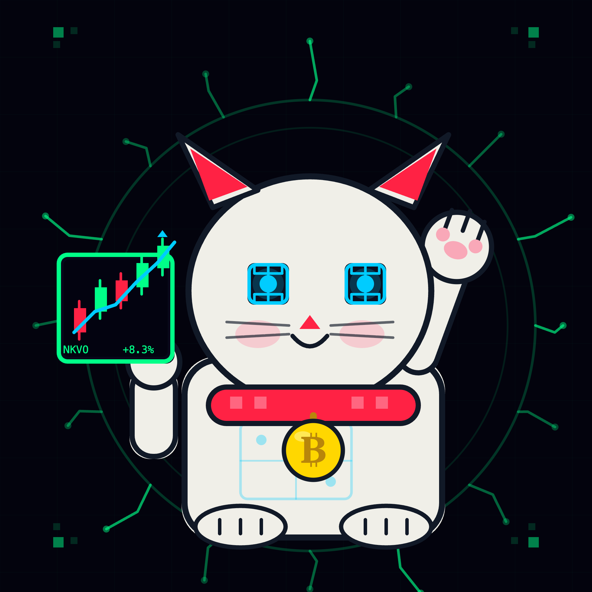

<div align="center">
  

  # NEKO VIVES

  **▲ VIVE TRADING CAT AGENT ▲**

  *Rust crypto trading agent for degens on EVM, Solana, TON, and Polymarket.*

  [](#license)
  [](https://www.rust-lang.org/)

</div>

Control your trades via Telegram or the built-in web dashboard.


---

## What it does

- **EVM** — Uniswap V3 quotes and swaps (Ethereum, Base, Arbitrum, Optimism, Polygon)
- **Solana** — Raydium / PumpFun via sol-trade-sdk
- **TON** — STON.fi swaps via tonlib-rs
- **Polymarket** — Prediction market trading via CLOB API (L1/L2 auth, limit & market orders)
- **Wallets** — BIP44 EVM, ED25519 Solana/TON — all encrypted at rest with AES-256-GCM + Argon2id
- **Backtesting** — Run `.rhai` strategy scripts against real Binance or Polymarket historical data; get Sharpe ratio, drawdown, win rate, and AI analysis
- **Strategy scripts** — Bundled strategies included (Polymarket 4-min momentum); write your own in Rhai
- **Market alerts** — 5-minute cron scanning TradingView RSI/MACD + Polymarket top markets
- **Telegram commands** — `/poly markets`, `/poly buy`, `/poly sell`, `/poly orders`, and more

---

## Architecture

```
neko-vives (binary)
├── crates/wallet-manager    — EVM BIP44, Solana ED25519, TON v4R2
├── crates/evm-trader        — Uniswap V2/V3/V4 via alloy
├── crates/solana-trader     — PumpFun, Raydium
├── crates/ton-trader        — STON.fi
├── crates/polymarket-trader — Gamma API + CLOB API, L1/L2 auth
└── crates/market-analyzer   — TradingView Screener client
```

---

## Prerequisites

You need **Rust 1.86+** and **cargo** installed. If you don't have them:

### macOS
```bash
# Install Homebrew (if not installed)
/bin/bash -c "$(curl -fsSL https://raw.githubusercontent.com/Homebrew/install/HEAD/install.sh)"

# Install Rust via rustup (recommended)
curl --proto '=https' --tlsv1.2 -sSf https://sh.rustup.rs | sh
source "$HOME/.cargo/env"

# Verify
rustc --version   # should be 1.86+
cargo --version
```

### Linux (Ubuntu / Debian / Arch)
```bash
# Install build essentials first
sudo apt update && sudo apt install -y build-essential pkg-config libssl-dev  # Ubuntu/Debian
# sudo pacman -S base-devel openssl                                            # Arch

# Install Rust via rustup
curl --proto '=https' --tlsv1.2 -sSf https://sh.rustup.rs | sh
source "$HOME/.cargo/env"

# Verify
rustc --version
cargo --version
```

### Windows
```powershell
# Option 1 — Rustup installer (recommended)
# Download and run: https://win.rustup.rs/x86_64
# Then in a new terminal:
rustc --version
cargo --version

# Option 2 — via winget
winget install Rustlang.Rustup
```
> **Note:** On Windows you also need [Visual Studio Build Tools](https://visualstudio.microsoft.com/visual-cpp-build-tools/) with the "Desktop development with C++" workload.

---

## Quick start

```bash
# Clone
git clone https://github.com/Neko-Vives-Labs/Neko-Vives.git
cd Neko-Vives

# Build web dashboard first, then the binary
cd web && npm run build && cd ..
cargo build --release

# First-time setup (creates ~/.config/trader-claw/config.toml)
./target/release/trader-claw onboard

# Interactive wizard (recommended for first time)
./target/release/trader-claw onboard --interactive

# Start daemon (Telegram + gateway + cron)
./target/release/trader-claw daemon

# Or just the gateway (web dashboard + API)
./target/release/trader-claw gateway
```

> **Windows path:** use `.\target\release\trader-claw.exe` instead.

---

## Installation (pre-built binaries)

No Rust required — grab a pre-built binary from [GitHub Releases](https://github.com/Neko-Vives-Labs/Neko-Vives/releases).

### One-liner (Linux / macOS)

```bash
curl -fsSL https://raw.githubusercontent.com/Neko-Vives-Labs/Neko-Vives/main/install.sh | sh
```

Installs to `/usr/local/bin/trader-claw`. Detects OS and architecture automatically.

### One-liner (Windows PowerShell)

```powershell
irm https://raw.githubusercontent.com/Neko-Vives-Labs/Neko-Vives/main/install.ps1 | iex
```

Installs to `%LOCALAPPDATA%\trader-claw\` and adds it to your PATH.

### Homebrew (macOS / Linux)

```bash
brew tap Neko-Vives-Labs/neko-vives
brew install neko-vives
```

### Scoop (Windows)

```powershell
scoop bucket add neko-vives https://github.com/Neko-Vives-Labs/scoop-neko-vives
scoop install neko-vives
```

### AUR (Arch Linux)

```bash
yay -S neko-vives-bin
# or: paru -S neko-vives-bin
```

### MSI installer (Windows)

Download `neko-vives-windows-x86_64.msi` from the latest [release](https://github.com/Neko-Vives-Labs/Neko-Vives/releases) — installs to `Program Files\Neko Vives\` and adds to system PATH.

### DMG (macOS)

Download `neko-vives-macos-arm64.dmg` (Apple Silicon) or `neko-vives-macos-x86_64.dmg` (Intel) from the latest [release](https://github.com/Neko-Vives-Labs/Neko-Vives/releases). Copy `trader-claw` to `/usr/local/bin/`.

> **Gatekeeper note:** macOS may block unsigned binaries. Right-click → Open → Open to allow.

### Self-update

Once installed, keep Neko Vives up to date with:

```bash
trader-claw update
```

This checks GitHub Releases, downloads the latest binary for your platform, and replaces the running binary in-place.

---

## Telegram commands

| Command | Description |
|---|---|
| `/poly markets [crypto\|politics\|sports]` | Top 10 Polymarket markets |
| `/poly price <slug>` | YES/NO price + volume |
| `/poly buy <slug> <yes\|no> <amount>` | Market buy order |
| `/poly sell <slug> <yes\|no> <amount>` | Market sell order |
| `/poly orders` | Active orders |
| `/poly positions` | Open positions |
| `/poly cancel <order_id>` | Cancel an order |

---

## Config

```toml
# ~/.config/trader-claw/config.toml

[telegram]
bot_token = "..."
allowed_users = ["@yourhandle"]

[cron]
enabled = true
interval_minutes = 5
polymarket_scan = true
portfolio_update = true

[secrets]
api_key = "..."
secret = "..."
passphrase = "..."
```

---

## Security

- Private keys and mnemonics are **never** logged
- All secrets encrypted at rest (AES-256-GCM, key derived via Argon2id)
- Polymarket wallet must be a dedicated Polygon wallet
- Telegram commands that place orders require `allowed_users` authorization

---

## Backtesting

Run Rhai strategy scripts against real historical data and get performance metrics.

```
Dashboard → /backtesting
  or
Agent chat: "backtest polymarket_4min.rhai on BTCUSDT from 2024-01-01 to 2024-12-31"
```

**Metrics reported:** Total Return %, Final Balance, Sharpe Ratio, Max Drawdown %, Win Rate, Trade Count, Avg Ticket, 5 Worst Trades, AI analysis.

**Bundled strategies** (written to `~/.config/trader-claw/scripts/` on first run):

| Script | Description |
|--------|-------------|
| `polymarket_4min.rhai` | Polymarket 4-minute momentum strategy — RSI + 4-candle momentum + volume confirmation (3-of-4), ATR-based stop loss and take profit |
| `weather_binary.rhai` | Weather threshold strategy (EMA/threshold scoring for YES/NO bets) |
| `strategy_reference.rhai` | Reference implementation showing the legacy `on_candle(candle_data, capital)` API |

**Writing your own strategy:**

Scripts use the `ctx`-based API and live in `~/.config/trader-claw/scripts/`:

```rhai
fn on_candle(ctx) {
    if ctx.index < 20 { return; }

    let rsi = ctx.rsi(14);
    let ema = ctx.ema(20);

    // Exit open position
    if ctx.position != 0.0 {
        let pnl = (ctx.close - ctx.entry_price) / ctx.entry_price * 100.0;
        if pnl >= 3.0 || pnl <= -2.0 { ctx.sell(1.0); }
        return;
    }

    // Enter long
    if rsi < 30.0 && ctx.close > ema {
        ctx.buy(1.0);
        ctx.set_stop_loss(ctx.close - ctx.atr(14) * 1.5);
        ctx.set_take_profit(ctx.close + ctx.atr(14) * 2.0);
    }
}
```

**Available `ctx` fields and methods:**

| Field / Method | Description |
|----------------|-------------|
| `ctx.close / open / high / low / volume` | Current candle OHLCV |
| `ctx.index` | Current bar index |
| `ctx.position` | Open position size (+long / −short / 0 flat) |
| `ctx.entry_price / entry_index` | Price and bar index of the open trade |
| `ctx.balance` | Current cash balance |
| `ctx.open_positions` | Number of open positions (0 or 1) |
| `ctx.close_at(i) / high_at(i) / low_at(i) / volume_at(i)` | Historical OHLCV lookup |
| `ctx.rsi(period) / ema(period) / atr(period)` | Built-in indicators |
| `ctx.buy(size) / sell(size)` | Open/close position |
| `ctx.set_stop_loss(price) / set_take_profit(price)` | Engine-enforced exit levels |
| `ctx.set("key", val) / get("key", default)` | Persist values across candles |

---

## Build & test

```bash
# Rebuild web dashboard
cd web && npm run build && cd ..

# Build binary (both steps required after any frontend change)
cargo build --release

# Run tests and lints
cargo test
cargo clippy -- -D warnings

# Docker
docker compose up -d
```

---

## License

MIT OR Apache-2.0
