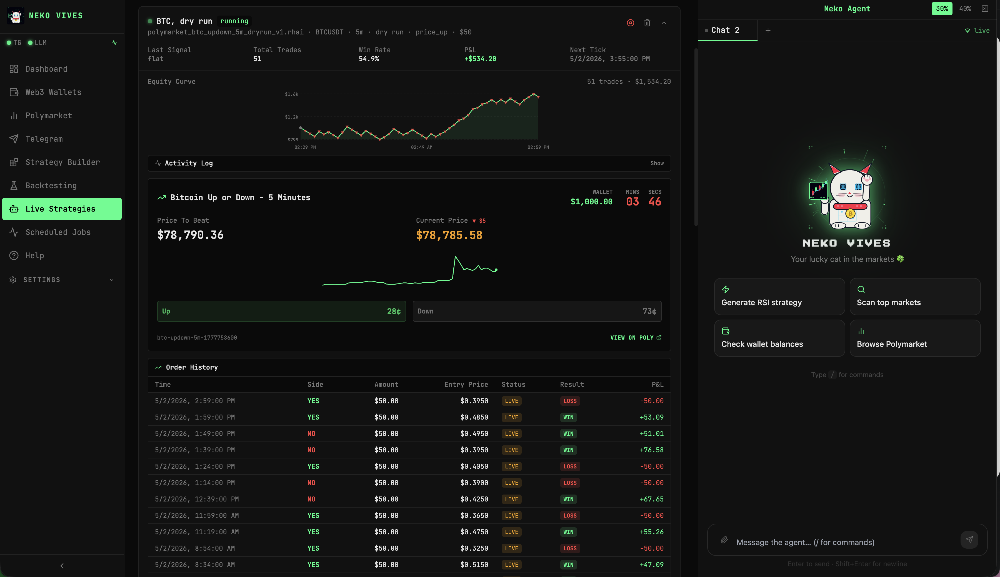

```
  $$$$$$$$$$$$$$$$$$$$$$$$$$$$$$$$$$$$$$$$$$$$$$$$$$$$$$$$$$$$$$$$$$$$$$$$$

  |         |              ████████╗██████╗  █████╗ ██████╗ ███████╗██████╗
  ▐▌    |   ▐▌   |    |    ╚══██╔══╝██╔══██╗██╔══██╗██╔══██╗██╔════╝██╔══██╗
  ▐▌    ▐▌  ▐▌   ▐▌   |       ██║   ██████╔╝███████║██║  ██║█████╗  ██████╔╝
  ▐▌    ▐▌  ▐▌   ▐▌   ▐▌      ██║   ██╔══██╗██╔══██║██║  ██║██╔══╝  ██╔══██╗
  |     ▐▌  |    ▐▌   ▐▌      ██║   ██║  ██║██║  ██║██████╔╝███████╗██║  ██║
        |        |    |        ╚═╝   ╚═╝  ╚═╝╚═╝  ╚═╝╚═════╝ ╚══════╝╚═╝  ╚═╝

  ▲ +420%              ██████╗██╗      █████╗ ██╗    ██╗
  |                    ██╔════╝██║     ██╔══██╗██║    ██║
  |    ___/            ██║     ██║     ███████║██║ █╗ ██║
  |___/                ██║     ██║     ██╔══██║██║███╗██║
  └──────────────>     ╚██████╗███████╗██║  ██║╚███╔███╔╝
                        ╚═════╝╚══════╝╚═╝  ╚═╝ ╚══╝╚══╝

           Buy the dip. 100% Rust. EVM · Solana · TON · Polymarket.

  $$$$$$$$$$$$$$$$$$$$$$$$$$$$$$$$$$$$$$$$$$$$$$$$$$$$$$$$$$$$$$$$$$$$$$$$$
```

**Rust crypto trading agent for degens on EVM, Solana, TON, and Polymarket.**

Control your trades via Telegram or the built-in web dashboard.



---

## What it does

- **EVM** — Uniswap V3 quotes and swaps (Ethereum, Base, Arbitrum, Optimism, Polygon)
- **Solana** — Raydium / PumpFun via sol-trade-sdk
- **TON** — STON.fi swaps via tonlib-rs
- **Polymarket** — Prediction market trading via CLOB API (L1/L2 auth, limit & market orders)
- **Wallets** — BIP44 EVM, ED25519 Solana/TON — all encrypted at rest with AES-256-GCM + Argon2id
- **Market alerts** — 5-minute cron scanning TradingView RSI/MACD + Polymarket top markets
- **Telegram commands** — `/poly markets`, `/poly buy`, `/poly sell`, `/poly orders`, and more

---

## Architecture

```
trader-agent (binary)
├── crates/wallet-manager    — EVM BIP44, Solana ED25519, TON v4R2
├── crates/evm-trader        — Uniswap V3 via raw JSON-RPC
├── crates/solana-trader     — PumpFun, Raydium
├── crates/ton-trader        — STON.fi
├── crates/polymarket-trader — Gamma API + CLOB API, L1/L2 auth
└── crates/market-analyzer   — TradingView Screener client
```

---

## Prerequisites

You need **Rust 1.86+** and **cargo** installed. If you don't have them:

### macOS
```bash
# Install Homebrew (if not installed)
/bin/bash -c "$(curl -fsSL https://raw.githubusercontent.com/Homebrew/install/HEAD/install.sh)"

# Install Rust via rustup (recommended)
curl --proto '=https' --tlsv1.2 -sSf https://sh.rustup.rs | sh
source "$HOME/.cargo/env"

# Verify
rustc --version   # should be 1.86+
cargo --version
```

### Linux (Ubuntu / Debian / Arch)
```bash
# Install build essentials first
sudo apt update && sudo apt install -y build-essential pkg-config libssl-dev  # Ubuntu/Debian
# sudo pacman -S base-devel openssl                                            # Arch

# Install Rust via rustup
curl --proto '=https' --tlsv1.2 -sSf https://sh.rustup.rs | sh
source "$HOME/.cargo/env"

# Verify
rustc --version
cargo --version
```

### Windows
```powershell
# Option 1 — Rustup installer (recommended)
# Download and run: https://win.rustup.rs/x86_64
# Then in a new terminal:
rustc --version
cargo --version

# Option 2 — via winget
winget install Rustlang.Rustup
```
> **Note:** On Windows you also need [Visual Studio Build Tools](https://visualstudio.microsoft.com/visual-cpp-build-tools/) with the "Desktop development with C++" workload.

---

## Quick start

```bash
# Clone
git clone https://github.com/Trader-Claw-Labs/Trader-Claw.git
cd Trader-Claw

# Build (first build downloads ~200 deps, takes 2-5 min)
cargo build --release

# First-time setup (creates ~/.config/trader-agent/config.toml)
./target/release/trader-agent onboard

# Interactive wizard (recommended for first time)
./target/release/trader-agent onboard --interactive

# Start daemon (Telegram + gateway + cron)
./target/release/trader-agent daemon

# Or just the agent loop
./target/release/trader-agent agent
```

> **Windows path:** use `.\target\release\trader-agent.exe` instead.

---

## Telegram commands

| Command | Description |
|---|---|
| `/poly markets [crypto\|politics\|sports]` | Top 10 Polymarket markets |
| `/poly price <slug>` | YES/NO price + volume |
| `/poly buy <slug> <yes\|no> <amount>` | Market buy order |
| `/poly sell <slug> <yes\|no> <amount>` | Market sell order |
| `/poly orders` | Active orders |
| `/poly positions` | Open positions |
| `/poly cancel <order_id>` | Cancel an order |

---

## Config

```toml
# ~/.config/trader-agent/config.toml

[telegram]
bot_token = "..."
allowed_users = ["@yourhandle"]

[cron]
enabled = true
interval_minutes = 5
polymarket_scan = true
portfolio_update = true

[secrets]
api_key = "..."
secret = "..."
passphrase = "..."
```

---

## Security

- Private keys and mnemonics are **never** logged
- All secrets encrypted at rest (AES-256-GCM, key derived via Argon2id)
- Polymarket wallet must be a dedicated Polygon wallet
- Telegram commands that place orders require `allowed_users` authorization

---

## Build & test

```bash
cargo build --release
cargo test
cargo clippy -- -D warnings
docker compose up -d
```

---

## License

MIT OR Apache-2.0

